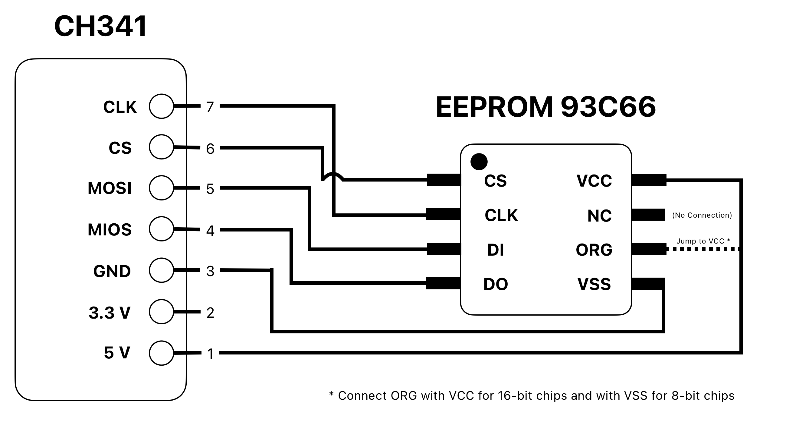
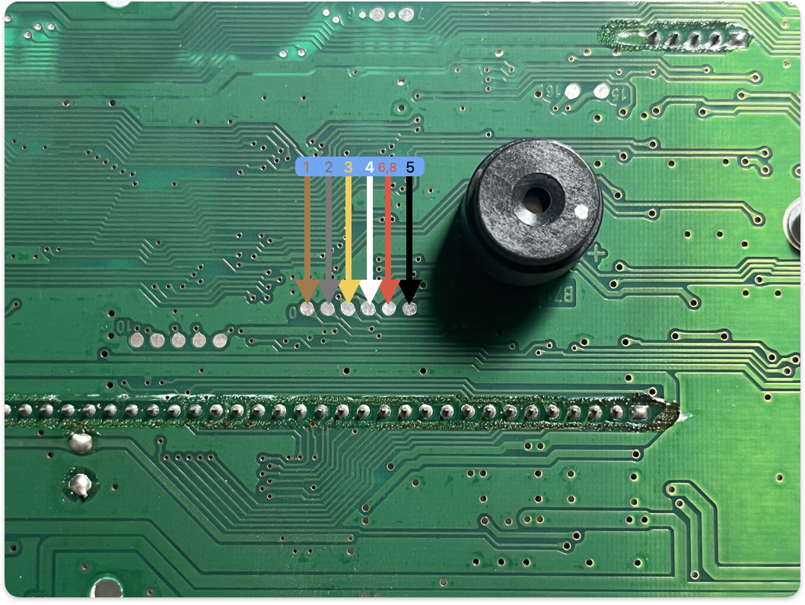

# Toyota Prius II Odometer correction

## Set-up
I followed [this video](https://www.youtube.com/watch?v=pb19p8zYeTg) on how to remove the cluster assembly.  

## Software
The operating system was Windows 10.  
For memory manipulation I used [AsProgrammer v2.0.4](https://github.com/nofeletru/UsbAsp-flash/releases/tag/v2.0.4) and later tried NeoProgrammer v2.2.0.10 which I liked even more.

## Connection
The general schema looks as follows:

### Prius II pin-out
Prius II (pre-lift) has CSI 93C66SI chip which is 16-bit.

